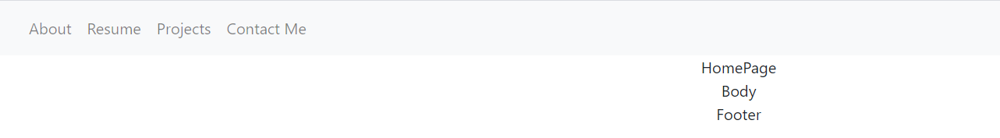

# Portfolio
 
## Jennifer Detmering

## Description-React Portfolio
### 
#### 
## Table of Contents
1. [Installation](#installation)
2. [Usage](#usage)
3. [Technologies Used](#technologies_used)
4. [Credits](#credits)
5. [License](#license)
6. [Features](#features)
7. [Questions and Contributions](#questions_and_contributions)
8. [Tests](#tests)
        
##  Installation-

## App Link
    
##  Usage- 

## Technologies Used-
React, npm, CSS, JavaScript, node.js

## Credits-  
[w3 schools](https://w3schools.com)

## License-

###  [License: MIT](https://opensource.org/licenses/MIT) 

## Features-
React Portfolio

## Questions and Contributions-  

## 
### GitHub Profile: https://github.com/kodiakshuksan
### Email: kodiakshuksan@yahoo.com

## Tests- 
none